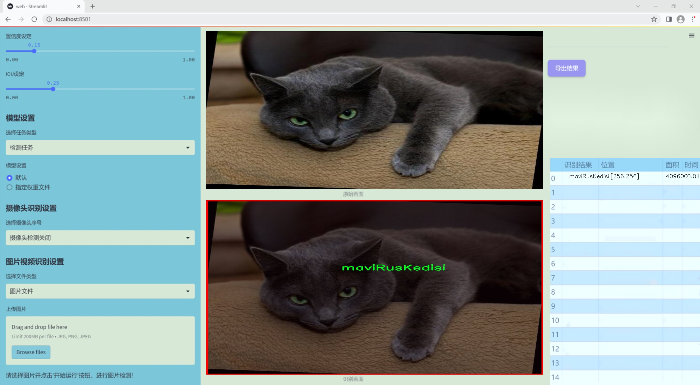
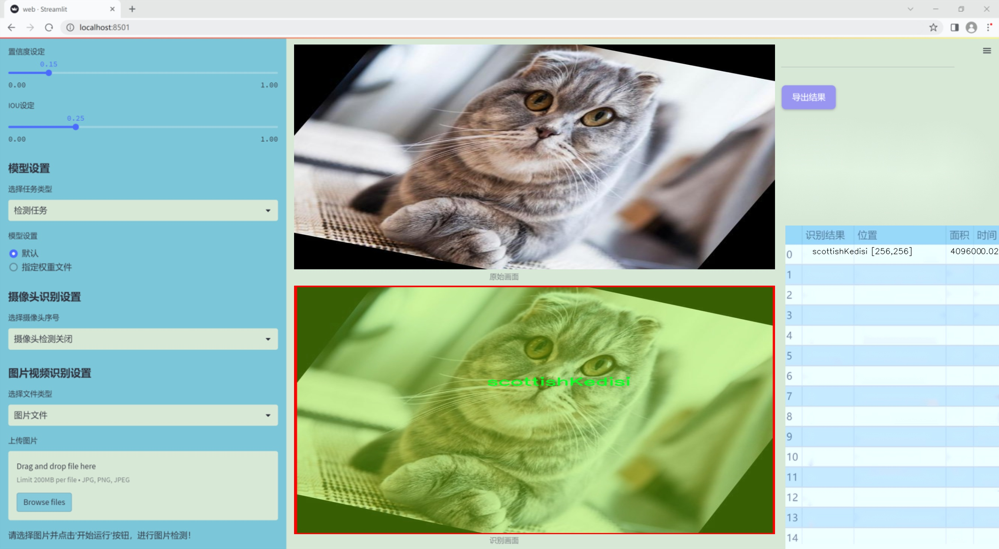
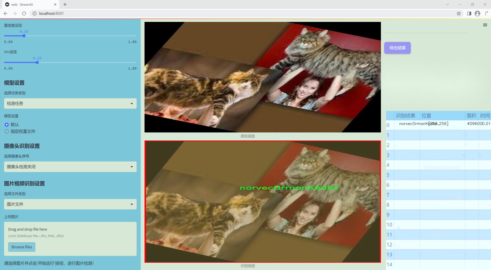
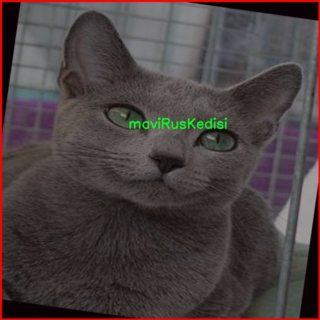
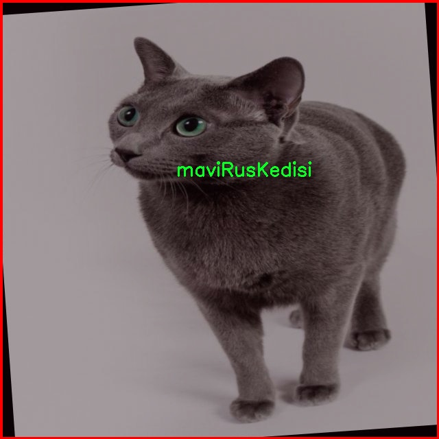
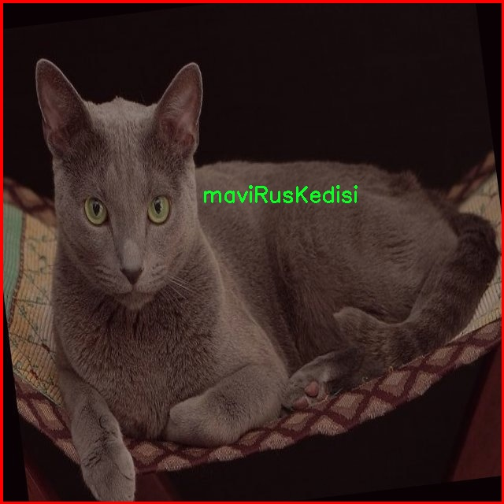
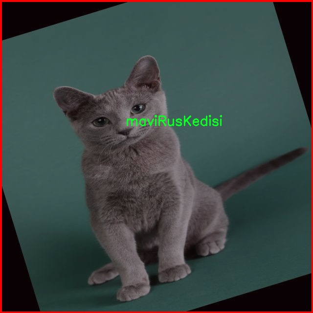
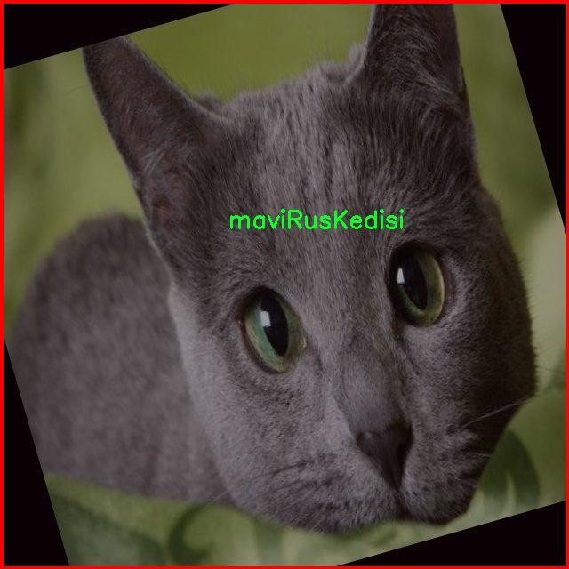

### 1.背景意义

研究背景与意义

随着人工智能技术的迅猛发展，计算机视觉在各个领域的应用日益广泛，尤其是在物体检测和实例分割方面。实例分割不仅要求模型能够识别图像中的物体，还需要对物体的精确轮廓进行分割，这对于提高图像理解的深度和准确性至关重要。在宠物行业，尤其是猫的品种识别和分类中，实例分割技术的应用潜力巨大。猫作为一种受欢迎的宠物，其多样的品种和外观特征使得自动化识别变得尤为重要。

本研究旨在基于改进的YOLOv11模型，构建一个高效的猫种类实例分割系统。我们所使用的数据集包含1600张图像，涵盖了五种不同的猫品种：maviRusKedisi、norvecOrmanKedisi、scottishKedisi、siyamKedisi和vanKedisi。这些品种各具特色，具有不同的外观特征和行为习惯，因此，开发一个能够准确识别和分割这些猫种类的系统，不仅可以为宠物爱好者提供更好的服务，还能为宠物行业的相关研究提供重要的数据支持。

通过对YOLOv11模型的改进，我们希望能够提高实例分割的精度和效率，尤其是在复杂背景下的表现。传统的物体检测方法在处理细粒度分类时往往存在局限，而实例分割技术的引入则能够有效克服这一问题。通过对猫种类的实例分割，不仅可以为宠物识别提供新的解决方案，还能为动物保护、繁育和健康管理等领域提供重要的技术支持。

总之，本研究的意义在于通过改进的YOLOv11模型，实现对猫种类的高效实例分割，为相关领域的应用提供技术基础，同时推动计算机视觉技术在动物识别领域的进一步发展。

### 2.视频效果

[2.1 视频效果](https://www.bilibili.com/video/BV1YcqqYtEUA/)

### 3.图片效果







##### [项目涉及的源码数据来源链接](https://kdocs.cn/l/cszuIiCKVNis)**

注意：本项目提供训练的数据集和训练教程,由于版本持续更新,暂不提供权重文件（best.pt）,请按照6.训练教程进行训练后实现上图演示的效果。

### 4.数据集信息

##### 4.1 本项目数据集类别数＆类别名

nc: 5
names: ['maviRusKedisi', 'norvecOrmanKedisi', 'scottishKedisi', 'siyamKedisi', 'vanKedisi']


该项目为【图像分割】数据集，请在【训练教程和Web端加载模型教程（第三步）】这一步的时候按照【图像分割】部分的教程来训练

##### 4.2 本项目数据集信息介绍

本项目数据集信息介绍

本项目旨在改进YOLOv11的猫种类实例分割系统，因此我们构建了一个专门的数据集，以支持这一目标。该数据集包含五种不同的猫种类，具体包括：maviRusKedisi（俄罗斯蓝猫）、norvecOrmanKedisi（挪威森林猫）、scottishKedisi（苏格兰折耳猫）、siyamKedisi（暹罗猫）和vanKedisi（梵猫）。这些猫种类各具特色，涵盖了不同的外观特征和行为习惯，适合用于训练深度学习模型进行精确的实例分割。

数据集的构建过程注重多样性和代表性，确保每种猫种类的样本数量均衡，以提高模型的泛化能力。我们从多个来源收集了大量的猫咪图像，涵盖了不同的环境、光照条件和姿态，力求在训练过程中使模型能够适应各种现实场景。每张图像都经过精细标注，确保猫咪的轮廓和特征被准确地捕捉，以便于后续的实例分割任务。

在数据集的设计中，我们特别关注了猫咪的不同特征，例如毛色、体型和耳朵形状等，这些都是区分不同猫种类的重要因素。通过对这些特征的深入分析，我们为每种猫咪提供了详细的标注信息，确保模型能够在复杂的背景中准确识别和分割出目标对象。

此外，为了增强模型的鲁棒性，我们还对数据集进行了数据增强处理，包括旋转、缩放、翻转等操作，以增加样本的多样性。这种方法不仅提高了模型的训练效果，还能有效防止过拟合现象的发生。通过这些精心设计的数据集，我们期望能够显著提升YOLOv11在猫种类实例分割任务中的性能，使其在实际应用中更加高效和准确。











### 5.全套项目环境部署视频教程（零基础手把手教学）

[5.1 所需软件PyCharm和Anaconda安装教程（第一步）](https://www.bilibili.com/video/BV1BoC1YCEKi/?spm_id_from=333.999.0.0&vd_source=bc9aec86d164b67a7004b996143742dc)


[5.2 安装Python虚拟环境创建和依赖库安装视频教程（第二步）](https://www.bilibili.com/video/BV1ZoC1YCEBw?spm_id_from=333.788.videopod.sections&vd_source=bc9aec86d164b67a7004b996143742dc)

### 6.改进YOLOv11训练教程和Web_UI前端加载模型教程（零基础手把手教学）

[6.1 改进YOLOv11训练教程和Web_UI前端加载模型教程（第三步）](https://www.bilibili.com/video/BV1BoC1YCEhR?spm_id_from=333.788.videopod.sections&vd_source=bc9aec86d164b67a7004b996143742dc)


按照上面的训练视频教程链接加载项目提供的数据集，运行train.py即可开始训练



     Epoch   gpu_mem       box       obj       cls    labels  img_size
     1/200     20.8G   0.01576   0.01955  0.007536        22      1280: 100%|██████████| 849/849 [14:42<00:00,  1.04s/it]
               Class     Images     Labels          P          R     mAP@.5 mAP@.5:.95: 100%|██████████| 213/213 [01:14<00:00,  2.87it/s]
                 all       3395      17314      0.994      0.957      0.0957      0.0843

     Epoch   gpu_mem       box       obj       cls    labels  img_size
     2/200     20.8G   0.01578   0.01923  0.007006        22      1280: 100%|██████████| 849/849 [14:44<00:00,  1.04s/it]
               Class     Images     Labels          P          R     mAP@.5 mAP@.5:.95: 100%|██████████| 213/213 [01:12<00:00,  2.95it/s]
                 all       3395      17314      0.996      0.956      0.0957      0.0845

     Epoch   gpu_mem       box       obj       cls    labels  img_size
     3/200     20.8G   0.01561    0.0191  0.006895        27      1280: 100%|██████████| 849/849 [10:56<00:00,  1.29it/s]
               Class     Images     Labels          P          R     mAP@.5 mAP@.5:.95: 100%|███████   | 187/213 [00:52<00:00,  4.04it/s]
                 all       3395      17314      0.996      0.957      0.0957      0.0845


###### [项目数据集下载链接](https://kdocs.cn/l/cszuIiCKVNis)

### 7.原始YOLOv11算法讲解


YOLO11 是 Ultralytics YOLO 系列的最新版本，结合了尖端的准确性、速度和效率，用于目标检测、分割、分类、定向边界框和姿态估计。与
YOLOv8 相比，它具有更少的参数和更好的结果，不难预见，YOLO11 在边缘设备上更高效、更快，将频繁出现在计算机视觉领域的最先进技术（SOTA）中。


**主要特点**

  * **增强的特征提取：**YOLO11 使用改进的主干和颈部架构来增强特征提取，以实现更精确的目标检测和复杂任务的性能。

  * **针对效率和速度优化：**精细的架构设计和优化的训练流程在保持准确性和性能之间最佳平衡的同时，提供更快的处理速度。

  * **更少的参数，更高的准确度：**YOLO11m 在 COCO 数据集上实现了比 YOLOv8m 更高的 mAP，参数减少了 22%，提高了计算效率，同时不牺牲准确度。

  * **跨环境的适应性：**YOLO11 可以无缝部署在边缘设备、云平台和配备 NVIDIA GPU 的系统上，确保最大的灵活性。

  * **支持广泛的任务范围：**YOLO11 支持各种计算机视觉任务，如目标检测、实例分割、图像分类、姿态估计和定向目标检测（OBB）。


### 8.200+种全套改进YOLOV11创新点原理讲解

#### 8.1 200+种全套改进YOLOV11创新点原理讲解大全

由于篇幅限制，每个创新点的具体原理讲解就不全部展开，具体见下列网址中的改进模块对应项目的技术原理博客网址【Blog】（创新点均为模块化搭建，原理适配YOLOv5~YOLOv11等各种版本）

[改进模块技术原理博客【Blog】网址链接](https://gitee.com/qunmasj/good)


#### 8.2 精选部分改进YOLOV11创新点原理讲解

###### 这里节选部分改进创新点展开原理讲解(完整的改进原理见上图和[改进模块技术原理博客链接](https://gitee.com/qunmasj/good)【如果此小节的图加载失败可以通过CSDN或者Github搜索该博客的标题访问原始博客，原始博客图片显示正常】

### 动态蛇形卷积Dynamic Snake Convolution

参考论文： 2307.08388.pdf (arxiv.org)

血管、道路等拓扑管状结构的精确分割在各个领域都至关重要，确保下游任务的准确性和效率。 然而，许多因素使任务变得复杂，包括薄的局部结构和可变的全局形态。在这项工作中，我们注意到管状结构的特殊性，并利用这些知识来指导我们的 DSCNet 在三个阶段同时增强感知：特征提取、特征融合、 和损失约束。 首先，我们提出了一种动态蛇卷积，通过自适应地关注细长和曲折的局部结构来准确捕获管状结构的特征。 随后，我们提出了一种多视图特征融合策略，以补充特征融合过程中多角度对特征的关注，确保保留来自不同全局形态的重要信息。 最后，提出了一种基于持久同源性的连续性约束损失函数，以更好地约束分割的拓扑连续性。 2D 和 3D 数据集上的实验表明，与多种方法相比，我们的 DSCNet 在管状结构分割任务上提供了更好的准确性和连续性。 我们的代码是公开的。 
主要的挑战源于细长微弱的局部结构特征与复杂多变的全局形态特征。本文关注到管状结构细长连续的特点，并利用这一信息在神经网络以下三个阶段同时增强感知：特征提取、特征融合和损失约束。分别设计了动态蛇形卷积（Dynamic Snake Convolution），多视角特征融合策略与连续性拓扑约束损失。 

我们希望卷积核一方面能够自由地贴合结构学习特征，另一方面能够在约束条件下不偏离目标结构太远。在观察管状结构的细长连续的特征后，脑海里想到了一个动物——蛇。我们希望卷积核能够像蛇一样动态地扭动，来贴合目标的结构。

我们希望卷积核一方面能够自由地贴合结构学习特征，另一方面能够在约束条件下不偏离目标结构太远。在观察管状结构的细长连续的特征后，脑海里想到了一个动物——蛇。我们希望卷积核能够像蛇一样动态地扭动，来贴合目标的结构。


### DCNV2融入YOLOv11
DCN和DCNv2（可变性卷积）
网上关于两篇文章的详细描述已经很多了，我这里具体的细节就不多讲了，只说一下其中实现起来比较困惑的点。（黑体字会讲解）

DCNv1解决的问题就是我们常规的图像增强，仿射变换（线性变换加平移）不能解决的多种形式目标变换的几何变换的问题。如下图所示。

可变性卷积的思想很简单，就是讲原来固定形状的卷积核变成可变的。如下图所示：


首先来看普通卷积，以3x3卷积为例对于每个输出y(p0)，都要从x上采样9个位置，这9个位置都在中心位置x(p0)向四周扩散得到的gird形状上，(-1,-1)代表x(p0)的左上角，(1,1)代表x(p0)的右下角，其他类似。

用公式表示如下：


可变性卷积Deformable Conv操作并没有改变卷积的计算操作，而是在卷积操作的作用区域上，加入了一个可学习的参数∆pn。同样对于每个输出y(p0)，都要从x上采样9个位置，这9个位置是中心位置x(p0)向四周扩散得到的，但是多了 ∆pn，允许采样点扩散成非gird形状。


偏移量是通过对原始特征层进行卷积得到的。比如输入特征层是w×h×c，先对输入的特征层进行卷积操作，得到w×h×2c的offset field。这里的w和h和原始特征层的w和h是一致的，offset field里面的值是输入特征层对应位置的偏移量，偏移量有x和y两个方向，所以offset field的channel数是2c。offset field里的偏移量是卷积得到的，可能是浮点数，所以接下来需要通过双向性插值计算偏移位置的特征值。在偏移量的学习中，梯度是通过双线性插值来进行反向传播的。
看到这里是不是还是有点迷茫呢？那到底程序上面怎么实现呢？


事实上由上面的公式我们可以看得出来∆pn这个偏移量是加在原像素点上的，但是我们怎么样从代码上对原像素点加这个量呢？其实很简单，就是用一个普通的卷积核去跟输入图片（一般是输入的feature_map）卷积就可以了卷积核的数量是2N也就是23*3==18（前9个通道是x方向的偏移量，后9个是y方向的偏移量），然后把这个卷积的结果与正常卷积的结果进行相加就可以了。
然后又有了第二个问题，怎么样反向传播呢？为什么会有这个问题呢？因为求出来的偏移量+正常卷积输出的结果往往是一个浮点数，浮点数是无法对应到原图的像素点的，所以自然就想到了双线性差值的方法求出浮点数对应的浮点像素点。


#### DCN v2
对于positive的样本来说，采样的特征应该focus在RoI内，如果特征中包含了过多超出RoI的内容，那么结果会受到影响和干扰。而negative样本则恰恰相反，引入一些超出RoI的特征有助于帮助网络判别这个区域是背景区域。

DCNv1引入了可变形卷积，能更好的适应目标的几何变换。但是v1可视化结果显示其感受野对应位置超出了目标范围，导致特征不受图像内容影响（理想情况是所有的对应位置分布在目标范围以内）。

为了解决该问题：提出v2, 主要有

1、扩展可变形卷积，增强建模能力
2、提出了特征模拟方案指导网络培训：feature mimicking scheme

上面这段话是什么意思呢，通俗来讲就是，我们的可变性卷积的区域大于目标所在区域，所以这时候就会对非目标区域进行错误识别。

所以自然能想到的解决方案就是加入权重项进行惩罚。（至于这个实现起来就比较简单了，直接初始化一个权重然后乘(input+offsets)就可以了）


可调节的RoIpooling也是类似的，公式如下：


### 9.系统功能展示

图9.1.系统支持检测结果表格显示

  图9.2.系统支持置信度和IOU阈值手动调节

  图9.3.系统支持自定义加载权重文件best.pt(需要你通过步骤5中训练获得)

  图9.4.系统支持摄像头实时识别

  图9.5.系统支持图片识别

  图9.6.系统支持视频识别

  图9.7.系统支持识别结果文件自动保存

  图9.8.系统支持Excel导出检测结果数据


### 10. YOLOv11核心改进源码讲解

#### 10.1 transformer.py

以下是对代码的逐文件分析，保留了核心部分并添加了详细的中文注释：

```python
import torch
import torch.nn as nn
from functools import partial

from .prepbn import RepBN, LinearNorm
from ..modules.transformer import TransformerEncoderLayer

__all__ = ['AIFI_RepBN']

# 定义线性归一化的部分函数
ln = nn.LayerNorm
linearnorm = partial(LinearNorm, norm1=ln, norm2=RepBN, step=60000)

class TransformerEncoderLayer_RepBN(TransformerEncoderLayer):
    def __init__(self, c1, cm=2048, num_heads=8, dropout=0, act=..., normalize_before=False):
        # 初始化父类TransformerEncoderLayer
        super().__init__(c1, cm, num_heads, dropout, act, normalize_before)
        
        # 使用线性归一化和RepBN进行归一化
        self.norm1 = linearnorm(c1)
        self.norm2 = linearnorm(c1)

class AIFI_RepBN(TransformerEncoderLayer_RepBN):
    """定义AIFI变换器层。"""

    def __init__(self, c1, cm=2048, num_heads=8, dropout=0, act=nn.GELU(), normalize_before=False):
        """使用指定参数初始化AIFI实例。"""
        super().__init__(c1, cm, num_heads, dropout, act, normalize_before)

    def forward(self, x):
        """AIFI变换器层的前向传播。"""
        c, h, w = x.shape[1:]  # 获取输入张量的通道数、高度和宽度
        pos_embed = self.build_2d_sincos_position_embedding(w, h, c)  # 构建2D正弦余弦位置嵌入
        # 将输入张量从形状[B, C, H, W]展平为[B, HxW, C]
        x = super().forward(x.flatten(2).permute(0, 2, 1), pos=pos_embed.to(device=x.device, dtype=x.dtype))
        # 将输出张量恢复为原始形状[B, C, H, W]
        return x.permute(0, 2, 1).view([-1, c, h, w]).contiguous()

    @staticmethod
    def build_2d_sincos_position_embedding(w, h, embed_dim=256, temperature=10000.0):
        """构建2D正弦余弦位置嵌入。"""
        assert embed_dim % 4 == 0, "嵌入维度必须是4的倍数，以便进行2D正弦余弦位置嵌入"
        grid_w = torch.arange(w, dtype=torch.float32)  # 创建宽度的网格
        grid_h = torch.arange(h, dtype=torch.float32)  # 创建高度的网格
        grid_w, grid_h = torch.meshgrid(grid_w, grid_h, indexing="ij")  # 生成网格坐标
        pos_dim = embed_dim // 4  # 计算位置维度
        omega = torch.arange(pos_dim, dtype=torch.float32) / pos_dim  # 计算频率
        omega = 1.0 / (temperature**omega)  # 应用温度缩放

        # 计算宽度和高度的正弦余弦嵌入
        out_w = grid_w.flatten()[..., None] @ omega[None]
        out_h = grid_h.flatten()[..., None] @ omega[None]

        # 返回拼接的正弦余弦位置嵌入
        return torch.cat([torch.sin(out_w), torch.cos(out_w), torch.sin(out_h), torch.cos(out_h)], 1)[None]
```

### 代码核心部分分析：
1. **导入模块**：导入了必要的PyTorch模块和自定义模块。
2. **线性归一化**：使用`partial`函数定义了一个带有特定参数的线性归一化函数。
3. **TransformerEncoderLayer_RepBN类**：继承自`TransformerEncoderLayer`，并在初始化中定义了两个归一化层。
4. **AIFI_RepBN类**：继承自`TransformerEncoderLayer_RepBN`，实现了前向传播和位置嵌入的构建。
5. **前向传播**：将输入张量展平并进行位置嵌入，然后恢复输出形状。
6. **位置嵌入构建**：静态方法生成2D正弦余弦位置嵌入，确保嵌入维度是4的倍数，并计算频率和位置嵌入。

### 注释说明：
注释详细解释了每个类和方法的功能，以及代码中每个重要步骤的目的和逻辑，帮助理解代码的整体结构和实现细节。

这个文件定义了一个基于Transformer架构的模型，主要是针对图像处理任务的改进版本，使用了RepBN（Reparameterized Batch Normalization）和线性归一化。首先，文件导入了必要的PyTorch库和模块，包括神经网络模块和功能模块，以及一些自定义的模块。

在文件中，首先定义了一个`linearnorm`的部分函数，这个函数结合了LayerNorm和RepBN，用于后续的归一化处理。接着，定义了一个名为`TransformerEncoderLayer_RepBN`的类，它继承自`TransformerEncoderLayer`。在这个类的构造函数中，调用了父类的构造函数，并初始化了两个归一化层，分别是`norm1`和`norm2`，它们都使用了之前定义的`linearnorm`。

接下来，定义了`AIFI_RepBN`类，它是`TransformerEncoderLayer_RepBN`的子类，代表了一个特定的Transformer层。这个类的构造函数与父类相似，但默认激活函数被设置为GELU。它还定义了一个`forward`方法，用于前向传播。在这个方法中，输入张量`x`的形状被转换为适合Transformer处理的格式，具体来说，首先提取出通道数、高度和宽度，然后构建二维的正弦余弦位置嵌入。接着，输入张量被展平并转置，以便于进行Transformer的前向计算，最后再将输出张量恢复到原来的形状。

此外，`AIFI_RepBN`类还包含一个静态方法`build_2d_sincos_position_embedding`，用于生成二维的正弦余弦位置嵌入。这个方法确保嵌入维度是4的倍数，并使用网格生成器创建宽度和高度的坐标网格。然后，通过计算得到的频率参数，生成对应的正弦和余弦值，并将它们合并为一个张量，作为位置嵌入的输出。

总体来说，这个文件实现了一个结合了RepBN和Transformer结构的图像处理层，旨在通过位置嵌入和归一化技术提高模型的性能。

#### 10.2 kaln_conv.py

以下是经过简化和注释的核心代码部分，保留了最重要的功能和结构：

```python
from functools import lru_cache
import torch
import torch.nn as nn
from torch.nn.functional import conv3d, conv2d, conv1d

class KALNConvNDLayer(nn.Module):
    def __init__(self, conv_class, norm_class, conv_w_fun, input_dim, output_dim, degree, kernel_size,
                 groups=1, padding=0, stride=1, dilation=1, dropout: float = 0.0, ndim: int = 2):
        super(KALNConvNDLayer, self).__init__()
        
        # 初始化参数
        self.inputdim = input_dim
        self.outdim = output_dim
        self.degree = degree
        self.kernel_size = kernel_size
        self.padding = padding
        self.stride = stride
        self.dilation = dilation
        self.groups = groups
        self.base_activation = nn.SiLU()  # 基础激活函数
        self.conv_w_fun = conv_w_fun  # 卷积权重函数
        self.ndim = ndim  # 维度
        self.dropout = None
        
        # 初始化 dropout
        if dropout > 0:
            if ndim == 1:
                self.dropout = nn.Dropout1d(p=dropout)
            elif ndim == 2:
                self.dropout = nn.Dropout2d(p=dropout)
            elif ndim == 3:
                self.dropout = nn.Dropout3d(p=dropout)

        # 检查参数有效性
        if groups <= 0:
            raise ValueError('groups must be a positive integer')
        if input_dim % groups != 0:
            raise ValueError('input_dim must be divisible by groups')
        if output_dim % groups != 0:
            raise ValueError('output_dim must be divisible by groups')

        # 创建基础卷积层和归一化层
        self.base_conv = nn.ModuleList([conv_class(input_dim // groups,
                                                   output_dim // groups,
                                                   kernel_size,
                                                   stride,
                                                   padding,
                                                   dilation,
                                                   groups=1,
                                                   bias=False) for _ in range(groups)])

        self.layer_norm = nn.ModuleList([norm_class(output_dim // groups) for _ in range(groups)])

        # 初始化多项式权重
        poly_shape = (groups, output_dim // groups, (input_dim // groups) * (degree + 1)) + tuple(
            kernel_size for _ in range(ndim))
        self.poly_weights = nn.Parameter(torch.randn(*poly_shape))

        # 使用 Kaiming 均匀分布初始化卷积层权重
        for conv_layer in self.base_conv:
            nn.init.kaiming_uniform_(conv_layer.weight, nonlinearity='linear')
        nn.init.kaiming_uniform_(self.poly_weights, nonlinearity='linear')

    @lru_cache(maxsize=128)  # 缓存以避免重复计算勒让德多项式
    def compute_legendre_polynomials(self, x, order):
        # 计算勒让德多项式
        P0 = x.new_ones(x.shape)  # P0 = 1
        if order == 0:
            return P0.unsqueeze(-1)
        P1 = x  # P1 = x
        legendre_polys = [P0, P1]

        # 使用递推公式计算高阶多项式
        for n in range(1, order):
            Pn = ((2.0 * n + 1.0) * x * legendre_polys[-1] - n * legendre_polys[-2]) / (n + 1.0)
            legendre_polys.append(Pn)

        return torch.concatenate(legendre_polys, dim=1)

    def forward_kal(self, x, group_index):
        # 前向传播
        base_output = self.base_conv[group_index](x)  # 基础卷积输出

        # 归一化输入以计算勒让德多项式
        x_normalized = 2 * (x - x.min()) / (x.max() - x.min()) - 1 if x.shape[0] > 0 else x

        if self.dropout is not None:
            x_normalized = self.dropout(x_normalized)  # 应用 dropout

        # 计算勒让德多项式
        legendre_basis = self.compute_legendre_polynomials(x_normalized, self.degree)
        # 使用多项式权重进行卷积操作
        poly_output = self.conv_w_fun(legendre_basis, self.poly_weights[group_index],
                                      stride=self.stride, dilation=self.dilation,
                                      padding=self.padding, groups=1)

        # 合并基础输出和多项式输出
        x = base_output + poly_output
        x = self.layer_norm[group_index](x)  # 归一化
        x = self.base_activation(x)  # 激活

        return x

    def forward(self, x):
        # 将输入分组并进行前向传播
        split_x = torch.split(x, self.inputdim // self.groups, dim=1)
        output = []
        for group_ind, _x in enumerate(split_x):
            y = self.forward_kal(_x.clone(), group_ind)
            output.append(y.clone())
        y = torch.cat(output, dim=1)  # 合并输出
        return y
```

### 代码说明：
1. **KALNConvNDLayer**: 这是一个自定义的神经网络层，支持多维卷积（1D、2D、3D）。
2. **初始化参数**: 在构造函数中，初始化输入输出维度、卷积参数、归一化层和多项式权重。
3. **勒让德多项式计算**: 使用递推公式计算勒让德多项式，并缓存结果以提高效率。
4. **前向传播**: 在 `forward_kal` 方法中，执行基础卷积、归一化、计算多项式输出并合并结果。
5. **分组处理**: 在 `forward` 方法中，将输入分组并对每个组进行前向传播，最后合并所有组的输出。

这个程序文件定义了一个名为 `KALNConvNDLayer` 的神经网络层，以及其一维、二维和三维的特定实现类。该层的设计目的是结合卷积操作和基于勒让德多项式的线性变换，以增强模型的表达能力。

首先，`KALNConvNDLayer` 类的构造函数接收多个参数，包括输入和输出维度、卷积核大小、组数、填充、步幅、扩张、丢弃率等。构造函数中会进行一些参数的验证，比如组数必须为正整数，输入和输出维度必须能被组数整除。接着，它会初始化基础卷积层和归一化层，并为多项式权重创建一个可训练的参数。

在该类中，`compute_legendre_polynomials` 方法用于计算勒让德多项式，利用递归关系生成多项式。这个方法使用了 `lru_cache` 装饰器来缓存计算结果，以避免重复计算，从而提高效率。

`forward_kal` 方法是核心的前向传播逻辑。它首先对输入进行基础卷积操作，然后对输入进行归一化处理，以便于后续的勒让德多项式计算。接着，调用 `compute_legendre_polynomials` 方法计算多项式基，并使用这些基和多项式权重进行卷积操作。最后，将基础输出和多项式输出相加，经过归一化和激活函数处理后返回结果。

`forward` 方法则负责将输入数据按组分割，并对每个组调用 `forward_kal` 方法进行处理，最后将所有组的输出拼接在一起。

此外，`KALNConv3DLayer`、`KALNConv2DLayer` 和 `KALNConv1DLayer` 类分别继承自 `KALNConvNDLayer`，并在构造函数中指定了相应的卷积类型和归一化层，以便于处理三维、二维和一维数据。

整体而言，这个程序实现了一个灵活且强大的卷积层，能够在多种维度上应用，并结合了高阶多项式的特性，适用于需要复杂特征提取的深度学习任务。

#### 10.3 test_selective_scan.py

以下是代码中最核心的部分，并附上详细的中文注释：

```python
import torch
import torch.nn.functional as F

def build_selective_scan_fn(selective_scan_cuda: object = None, mode="mamba_ssm", tag=None):
    """
    构建选择性扫描函数的工厂函数。
    
    参数:
    selective_scan_cuda: CUDA实现的选择性扫描函数。
    mode: 选择的模式。
    tag: 可选的标签，用于表示函数的特性。
    
    返回:
    selective_scan_fn: 构建的选择性扫描函数。
    """
    
    class SelectiveScanFn(torch.autograd.Function):
        @staticmethod
        def forward(ctx, u, delta, A, B, C, D=None, z=None, delta_bias=None, delta_softplus=False, return_last_state=False, nrows=1, backnrows=-1):
            """
            前向传播函数，执行选择性扫描操作。
            
            参数:
            ctx: 上下文对象，用于保存状态。
            u: 输入张量。
            delta: 变化率张量。
            A, B, C: 权重张量。
            D: 可选的张量。
            z: 可选的张量。
            delta_bias: 可选的偏置。
            delta_softplus: 是否使用softplus激活。
            return_last_state: 是否返回最后的状态。
            nrows: 行数。
            backnrows: 反向传播时的行数。
            
            返回:
            out: 输出张量。
            last_state: 最后状态（可选）。
            """
            # 确保输入张量是连续的
            if u.stride(-1) != 1:
                u = u.contiguous()
            if delta.stride(-1) != 1:
                delta = delta.contiguous()
            if D is not None:
                D = D.contiguous()
            if B.stride(-1) != 1:
                B = B.contiguous()
            if C.stride(-1) != 1:
                C = C.contiguous()
            if z is not None and z.stride(-1) != 1:
                z = z.contiguous()

            # 处理B和C的维度
            if B.dim() == 3:
                B = rearrange(B, "b dstate l -> b 1 dstate l")
                ctx.squeeze_B = True
            if C.dim() == 3:
                C = rearrange(C, "b dstate l -> b 1 dstate l")
                ctx.squeeze_C = True

            # 确保数据类型为float
            if D is not None and (D.dtype != torch.float):
                ctx._d_dtype = D.dtype
                D = D.float()
            if delta_bias is not None and (delta_bias.dtype != torch.float):
                ctx._delta_bias_dtype = delta_bias.dtype
                delta_bias = delta_bias.float()

            # 确保输入的形状符合要求
            assert u.shape[1] % (B.shape[1] * nrows) == 0 
            assert nrows in [1, 2, 3, 4]

            # 选择性扫描的CUDA实现
            out, x, *rest = selective_scan_cuda.fwd(u, delta, A, B, C, D, z, delta_bias, delta_softplus)

            # 保存状态以供反向传播使用
            ctx.save_for_backward(u, delta, A, B, C, D, delta_bias, x)

            # 返回输出和最后状态
            last_state = x[:, :, -1, 1::2]  # (batch, dim, dstate)
            return out if not return_last_state else (out, last_state)

        @staticmethod
        def backward(ctx, dout):
            """
            反向传播函数，计算梯度。
            
            参数:
            ctx: 上下文对象，包含前向传播时保存的状态。
            dout: 输出的梯度。
            
            返回:
            梯度的元组。
            """
            # 从上下文中恢复保存的张量
            u, delta, A, B, C, D, delta_bias, x = ctx.saved_tensors
            
            # 确保梯度是连续的
            if dout.stride(-1) != 1:
                dout = dout.contiguous()

            # 调用CUDA实现的反向传播
            du, ddelta, dA, dB, dC, dD, ddelta_bias, *rest = selective_scan_cuda.bwd(
                u, delta, A, B, C, D, delta_bias, dout, x, ctx.delta_softplus
            )

            return (du, ddelta, dA, dB, dC, dD if D is not None else None, ddelta_bias if delta_bias is not None else None)

    def selective_scan_fn(u, delta, A, B, C, D=None, z=None, delta_bias=None, delta_softplus=False, return_last_state=False, nrows=1, backnrows=-1):
        """
        封装选择性扫描函数的调用。
        
        参数:
        u, delta, A, B, C, D, z, delta_bias, delta_softplus, return_last_state, nrows, backnrows: 同前向传播函数的参数。
        
        返回:
        outs: 输出张量。
        """
        outs = SelectiveScanFn.apply(u, delta, A, B, C, D, z, delta_bias, delta_softplus, return_last_state, nrows, backnrows)
        return outs

    return selective_scan_fn
```

### 代码核心部分说明：
1. **构建选择性扫描函数**：`build_selective_scan_fn`函数用于创建一个选择性扫描的自定义函数，支持前向和反向传播。
2. **前向传播**：`forward`方法执行选择性扫描的核心计算，并保存必要的张量以供反向传播使用。
3. **反向传播**：`backward`方法计算梯度，使用CUDA实现的反向传播函数来处理梯度计算。
4. **封装函数**：`selective_scan_fn`函数是对选择性扫描操作的封装，方便调用。

这些核心部分是实现选择性扫描的基础，涉及到的张量操作和CUDA调用是实现高效计算的关键。

这个程序文件 `test_selective_scan.py` 是一个用于测试选择性扫描（Selective Scan）操作的实现，主要依赖于 PyTorch 库。文件中包含了选择性扫描的前向和反向传播的实现，以及相应的测试用例。

程序首先导入了必要的库，包括数学运算、PyTorch 及其功能模块、pytest 测试框架等。接着定义了一个函数 `build_selective_scan_fn`，用于构建选择性扫描的自定义函数类 `SelectiveScanFn`。这个类包含了前向传播（`forward`）和反向传播（`backward`）的静态方法。

在 `forward` 方法中，首先对输入张量进行连续性检查，确保它们在内存中是连续的。接着根据输入的维度和形状进行必要的调整和重排。然后，程序根据不同的模式（如 `mamba_ssm`、`ssoflex` 等）调用相应的 CUDA 实现进行前向计算，并保存必要的上下文信息以供反向传播使用。最后，返回计算结果或最后状态。

`backward` 方法实现了反向传播的逻辑，计算输入张量的梯度。根据不同的模式，调用相应的 CUDA 实现进行反向计算，并返回各个输入的梯度。

文件中还定义了 `selective_scan_ref` 和 `selective_scan_ref_v2` 函数，这些是选择性扫描的参考实现，用于与 CUDA 实现的结果进行比较，确保其正确性。

在文件的最后部分，定义了一个 `test_selective_scan` 测试函数，使用 pytest 的参数化功能，针对不同的输入配置（如数据类型、序列长度、是否包含偏置等）进行测试。测试中会生成随机输入数据，调用选择性扫描函数，并与参考实现的输出进行比较，确保它们在数值上足够接近。同时，测试还会验证反向传播的梯度是否一致。

整个程序的设计旨在验证选择性扫描操作的正确性和性能，适用于深度学习模型中的动态计算图场景。通过使用 CUDA 加速，程序能够高效地处理大规模数据，适合在 GPU 上运行。

#### 10.4 TransNext.py

以下是代码中最核心的部分，并附上详细的中文注释：

```python
try:
    # 尝试导入 swattention 模块和 TransNext_cuda 中的所有内容
    import swattention
    from ultralytics.nn.backbone.TransNeXt.TransNext_cuda import *
except ImportError as e:
    # 如果导入失败（例如，模块不存在），则导入 TransNext_native 中的所有内容
    from ultralytics.nn.backbone.TransNeXt.TransNext_native import *
    pass
```

### 注释说明：
1. **try-except 结构**：该结构用于处理可能出现的异常。在这里，程序首先尝试执行 `try` 块中的代码，如果出现 `ImportError`（导入错误），则会跳转到 `except` 块。

2. **导入模块**：
   - `import swattention`：尝试导入名为 `swattention` 的模块。如果该模块存在，则可以使用其中的功能。
   - `from ultralytics.nn.backbone.TransNeXt.TransNext_cuda import *`：尝试从 `TransNext_cuda` 模块中导入所有内容。这个模块可能包含与 CUDA 相关的实现，通常用于加速计算。

3. **异常处理**：
   - `except ImportError as e`：捕获导入错误，并将错误信息存储在变量 `e` 中。虽然在这里没有对 `e` 进行处理，但可以用于调试或记录错误信息。
   - `from ultralytics.nn.backbone.TransNeXt.TransNext_native import *`：如果 `TransNext_cuda` 导入失败，则尝试从 `TransNext_native` 模块中导入所有内容。这个模块可能是一个不依赖于 CUDA 的实现，适用于没有 GPU 的环境。

4. **pass 语句**：在 `except` 块中使用 `pass` 表示什么都不做，程序将继续执行后面的代码。

这个程序文件名为 `TransNext.py`，主要功能是导入一个名为 `swattention` 的模块，并尝试从 `ultralytics.nn.backbone.TransNeXt` 包中导入 `TransNext_cuda` 类或函数。如果在导入 `TransNext_cuda` 时发生 `ImportError` 异常，程序会捕获这个异常，并尝试导入 `TransNext_native` 作为替代。

具体来说，程序的执行流程如下：

1. 首先，程序尝试导入 `swattention` 模块，这个模块可能是与注意力机制相关的实现，通常在深度学习模型中用于增强特征表示。
2. 接着，程序尝试从 `ultralytics.nn.backbone.TransNeXt` 路径下导入 `TransNext_cuda`。这个模块可能是一个与 CUDA 相关的实现，利用 GPU 加速来提高模型的运行效率。
3. 如果在导入 `TransNext_cuda` 时发生错误（例如，CUDA 相关的库未安装或不兼容），程序会捕获这个 `ImportError` 异常，并执行 `except` 块中的代码。
4. 在 `except` 块中，程序会尝试导入 `TransNext_native`，这是一个可能的替代实现，通常是 CPU 版本的实现，确保即使在没有 CUDA 支持的环境中，程序仍然可以运行。
5. `pass` 语句表示在捕获异常后不执行任何操作，程序将继续执行后续的代码（如果有的话）。

总的来说，这段代码实现了对不同实现版本的灵活导入，确保在不同的环境下都能正常运行。

### 11.完整训练+Web前端界面+200+种全套创新点源码、数据集获取


# [下载链接：https://mbd.pub/o/bread/Z5yZmZtw](https://mbd.pub/o/bread/Z5yZmZtw)